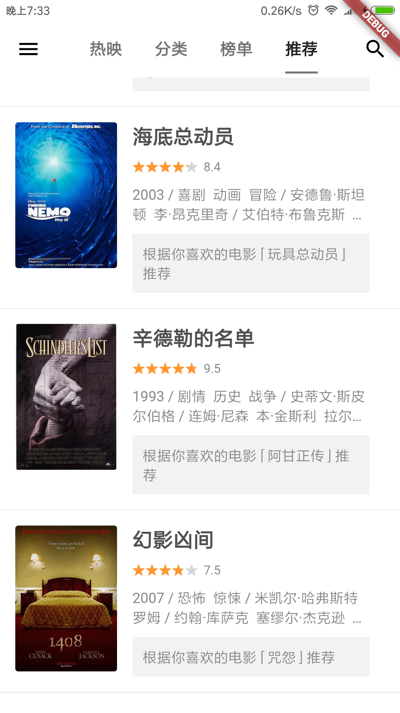
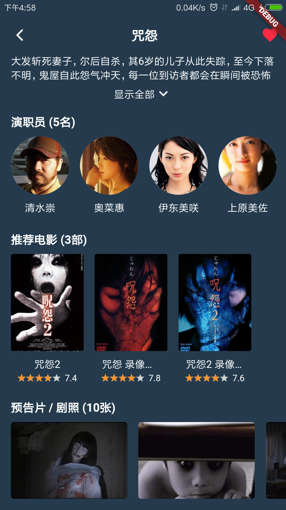
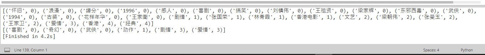
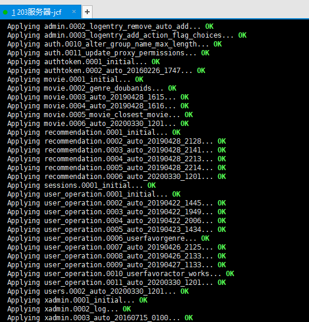
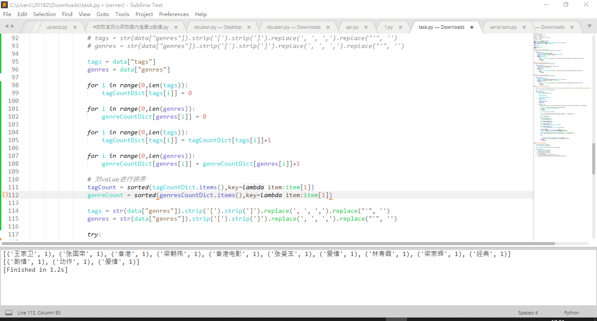
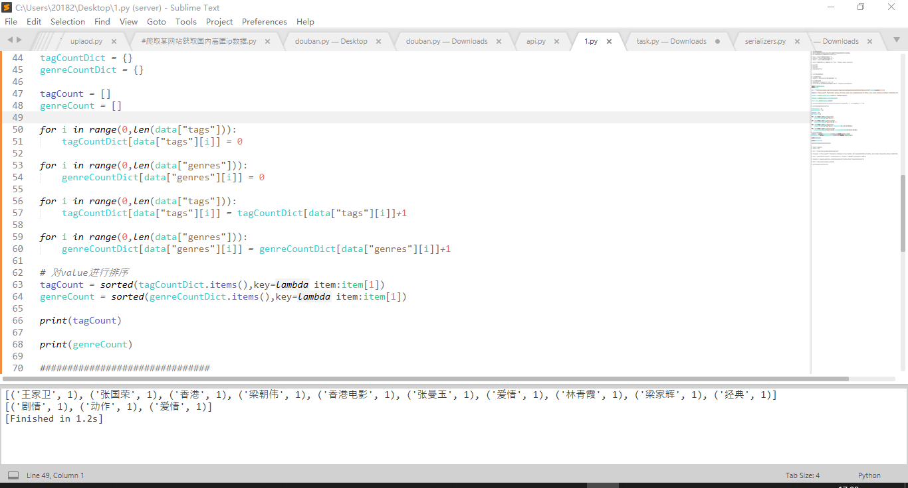
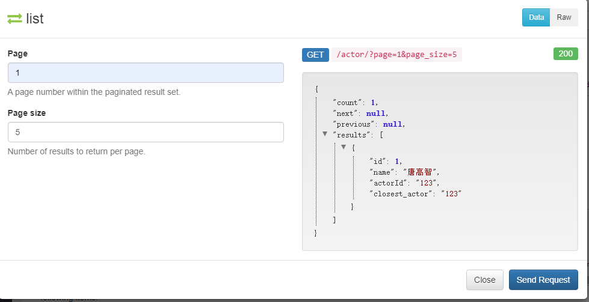
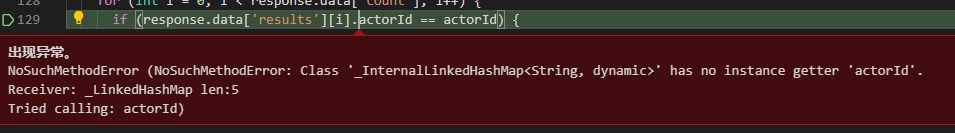

# flutter_movie【Django及Flask端未上传，打算看该项目大家有没有兴趣再上传，文末有截图及视频】
一个可解释性电影推荐系统，系统分为 App 端以及服务器端，App可在安卓端使用，服务器使用Python 流行Web框架 Django 和Flask搭建，并使用定时任务 crontab 命令进行定时推荐。APP端实现了用户登录注册、查看最新电影列表、电影 top 榜单、电影详情、电影评分、推荐列表和其推荐解释等功能，并采用模板的方式生成解释呈现给用户，使推荐更可以得到用户的信任。

# 原项目
https://github.com/Mayandev/django_morec

# APP改进
原项目的app可以说是无法使用，我当初19年clone下来就无法使用了，比如搜索功能，还有其对应推荐功能等等。我还增加了电影推荐功能（用到了一些智能算法，但在github上传的版本只涉及基于item的推荐）

# 使用方法
安装完所需要的包直接允许即可，但是后端也要同时连接，具体操作看原项目的介绍

# APP运行视频

https://www.bilibili.com/video/BV1mh411S75k/

# APP截图

## APP展示

## 运行django后端

## 个人修改后端推荐代码【自创版本，智能算法版本不上传】

## API

## 项目过程记录

## Flask端用来进行搭建API以及处理爬虫信息，没截图。

